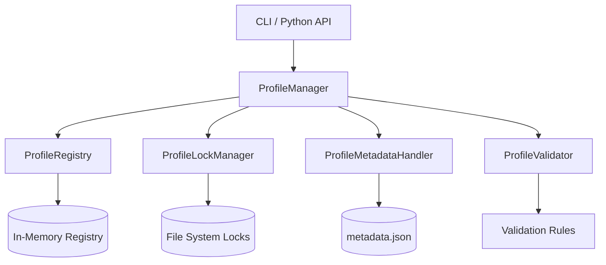

# Multi-Account Profile Manager – Design Specification (v0.1.6)

---

## 1. Executive Summary

This specification defines a **CLI/API-first Profile Manager** system enables seamless multi-account handling for WhatsApp (with extensibility to Telegram, Discord, and other platforms). The design guarantees:

- ✅ Complete profile isolation with atomic operations  
- ✅ Active profile protection against accidental deletion  
- ✅ Thread-safe concurrency handling via file locking  
- ✅ Corruption detection and recovery mechanisms  
- ✅ Zero breaking changes for existing single-account users  
- ✅ Platform-agnostic architecture for future extensibility  

*No GUI components are included in v0.1.6 scope. All interactions occur via CLI commands or Python API.*

---

## 2. Core Design Philosophy

### 2.1 Profile = Platform + Account Context
Each profile is a self-contained unit with:
```text
Profile
├── Platform Type (whatsapp | telegram | discord | ...)
├── Account Context (session, credentials, state)
├── Browser Fingerprint (isolated per profile)
├── Metadata (creation time, last used, status)
└── Lock State (active/inactive protection)
```

### 2.2 Key Principles
| Principle | Implementation |
|-----------|----------------|
| **Isolation** | Zero shared state between profiles; separate directories for all artifacts |
| **Safety** | Atomic operations with rollback on failure; active profile deletion blocked |
| **Concurrency** | File-based locking with stale lock detection |
| **Recoverability** | Corruption detection + soft/hard recovery modes |
| **Extensibility** | Platform-agnostic interfaces; metadata-driven configuration |

---

## 3. Directory Structure

```
profiles/
├── default/                     # ← Backward-compatible default profile
│   ├── metadata.json
│   ├── session.json
│   ├── browser_profile/
│   ├── cache/
│   └── .lock                    # ← Active profile lock file
│
├── support_bot/
│   ├── metadata.json
│   ├── session.json
│   ├── browser_profile/
│   ├── cache/
│   └── .lock
│
└── sales_team/
    ├── metadata.json
    ├── session.json
    ├── browser_profile/
    ├── cache/
    └── .lock
```

### `metadata.json` Schema
```json
{
  "profile_id": "string (alphanumeric, max 32 chars)",
  "platform": "whatsapp | telegram | discord | custom",
  "platform_version": "string (optional)",
  "created_at": "ISO 8601 timestamp",
  "last_used": "ISO 8601 timestamp",
  "status": "active | inactive | corrupted",
  "lock_pid": "integer (optional, OS process ID)"
}
```

---

## 4. Component Architecture

### 4.1 System Diagram


### 4.2 Core Classes (`src/BrowserManager/profile_manager.py`)

| Class | Responsibilities | Key Methods |
|-------|------------------|-------------|
| **`ProfileManager`** | Primary interface for all profile operations | `create()`, `activate()`, `deactivate()`, `delete()`, `list()`, `recover()` |
| **`ProfileRegistry`** | In-memory registry of profiles; prevents duplicates | `register()`, `unregister()`, `get_active()`, `is_active()` |
| **`ProfileLockManager`** | File-based locking with stale lock detection | `acquire()`, `release()`, `is_locked()`, `cleanup_stale()` |
| **`ProfileMetadataHandler`** | Atomic metadata reads/writes with validation | `load()`, `save()`, `validate()`, `mark_corrupted()` |
| **`ProfileValidator`** | Business rule enforcement | `validate_id()`, `validate_platform()`, `can_delete()` |

---

## 5. Profile Lifecycle Flows

### 5.1 Creation Flow (Atomic)
```python
def create_profile(profile_id: str, platform: str) -> ProfileContext:
    with atomic_transaction():  # ← Rollback on ANY failure
        validate_id_uniqueness(profile_id)
        create_directory_structure(profile_id)
        initialize_metadata(profile_id, platform)
        create_empty_session(profile_id)
        register_in_memory(profile_id)
    return ProfileContext(profile_id)
```

### 5.2 Activation Flow (Safe Switching)
```python
def activate_profile(profile_id: str):
    if not exists(profile_id):
        raise ProfileNotFoundError
    
    if registry.get_active() == profile_id:
        return  # Already active
    
    with lock_manager.acquire(profile_id):  # ← Blocks if locked by another process
        if registry.has_active():
            deactivate_current()  # ← Auto-deactivate previous profile
        
        update_metadata(profile_id, status="active", last_used=now())
        registry.set_active(profile_id)
```

### 5.3 Deletion Flow (Protected)
```python
def delete_profile(profile_id: str, force: bool = False):
    if lock_manager.is_locked(profile_id) and not force:
        raise ProfileActiveError(
            f"Profile '{profile_id}' is active. Deactivate first or use --force."
        )
    
    if not force and registry.get_active() == profile_id:
        raise ProfileActiveError("Cannot delete currently active profile")
    
    safe_remove_directory(profile_id)  # ← Handles partial deletions
    registry.unregister(profile_id)
```

---

## 6. Edge Case Handling

| Edge Case | Detection Mechanism | Resolution Strategy |
|-----------|---------------------|---------------------|
| **Active Profile Deletion** | File lock + registry check | Block operation; require explicit `--force` flag |
| **Concurrent Access** | File-based lock with PID tracking | Block until lock released; timeout after 30s |
| **Stale Lock** | PID validation + process existence check | Auto-remove lock after warning log |
| **Metadata Corruption** | JSON schema validation on load | Mark status=`corrupted`; block activation; offer `recover()` |
| **Partial Creation** | Atomic transaction wrapper | Full rollback on any failure during creation |
| **Disk Full During Write** | Atomic file replacement pattern | Preserve previous valid state; fail operation cleanly |

### Corruption Recovery Modes
```python
manager.recover_profile("support_bot", mode="soft")
# → Recreates metadata.json from directory structure

manager.recover_profile("support_bot", mode="hard")
# → Resets session.json + browser_profile/ (loses auth state)
```

---

## 7. CLI / API Interface (v0.1.6)

### 7.1 CLI Commands
```bash
# Profile lifecycle
tweakio profile create <id> --platform whatsapp
tweakio profile activate <id>
tweakio profile deactivate
tweakio profile delete <id> [--force]

# Discovery & diagnostics
tweakio profile list [--all | --active | --corrupted]
tweakio profile status <id>
tweakio profile recover <id> [--mode soft|hard]

# Backward compatibility (uses 'default' profile)
tweakio whatsapp login   # ← Implicitly uses 'default' profile
```

### 7.2 Python API
```python
from tweakio import ProfileManager

pm = ProfileManager()

# Create and activate
pm.create_profile("support_bot", platform="whatsapp")
pm.activate_profile("support_bot")

# Safe deletion
try:
    pm.delete_profile("support_bot")  # ← Fails if active
except ProfileActiveError:
    pm.deactivate_profile()
    pm.delete_profile("support_bot")

# List with metadata
profiles = pm.list_profiles()
for p in profiles:
    print(f"{p.id} ({p.platform}): {p.status} | last used: {p.last_used}")
```

---

## 8. Multi-Platform Extensibility

### Platform Registration Pattern
```python
# Future extension (post v0.1.6)
from tweakio.platforms import register_platform

register_platform(
    name="telegram",
    session_handler=TelegramSessionHandler,
    fingerprint_generator=TelegramFingerprintGenerator
)
```

### Profile Metadata Evolution
```json
{
  "profile_id": "news_bot",
  "platform": "telegram",
  "platform_config": {
    "api_id": "******",
    "api_hash": "******"
  },
  "created_at": "2026-02-10T14:30:00Z",
  "status": "inactive"
}
```

*No changes required to `ProfileManager` core for new platforms.*

---

## 9. Backward Compatibility Guarantees

| Existing Behavior | v0.1.6 Behavior |
|-------------------|-----------------|
| `tweakio whatsapp login` | Uses `profiles/default/` implicitly | 
| Single `browser_profile/` dir | Migrated to `profiles/default/browser_profile/` on first run |  
| Existing `session.json` | Moved to `profiles/default/session.json` | 
| Direct `BrowserManager` usage | Unchanged; operates on active profile | 

*Migration occurs silently on first profile operation with user notification.*

---

## 10. Future Roadmap (Post v0.1.6)

| Feature | Complexity | Notes |
|---------|------------|-------|
| Parallel multi-account execution | Medium | Requires process isolation |
| Profile encryption at rest | High | Key management complexity |
| Profile import/export (ZIP) | Low | Useful for backup/migration |
| Remote profile management API | High | Requires auth/security design |
| Lightweight TUI dashboard | Medium | Built atop CLI API |

---

## 11. Implementation Quality Gates

- ✅ 100% type-hinted Python 3.10+ code  
- ✅ Dependency injection ready (for testability)  
- ✅ >90% unit test coverage (pytest)  
- ✅ Atomic file operations using ` tempfile + rename` pattern  
- ✅ Comprehensive logging at DEBUG/INFO/WARNING levels  
- ✅ Windows/Linux/macOS path compatibility  

---

## 12. Conclusion

This design delivers a **production-ready foundation** for multi-account management that:

1. Solves immediate WhatsApp multi-account needs with safety guarantees  
2. Provides extensible architecture for multi-platform support  
3. Maintains full backward compatibility for existing users  
4. Establishes patterns for concurrency safety and corruption recovery  
5. Delivers CLI/API-first interface suitable for automation and future GUI layers  

The proposal intentionally avoids GUI complexity in v0.1.6 to ensure a **robust, testable core** that can support any presentation layer in subsequent releases.

---
